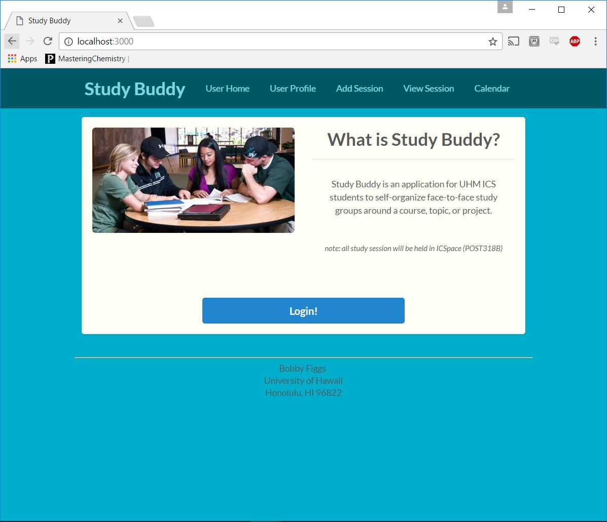
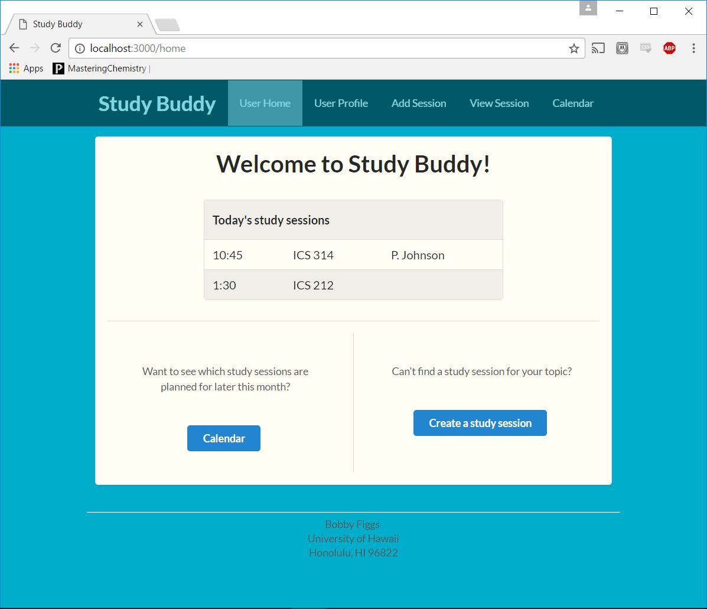
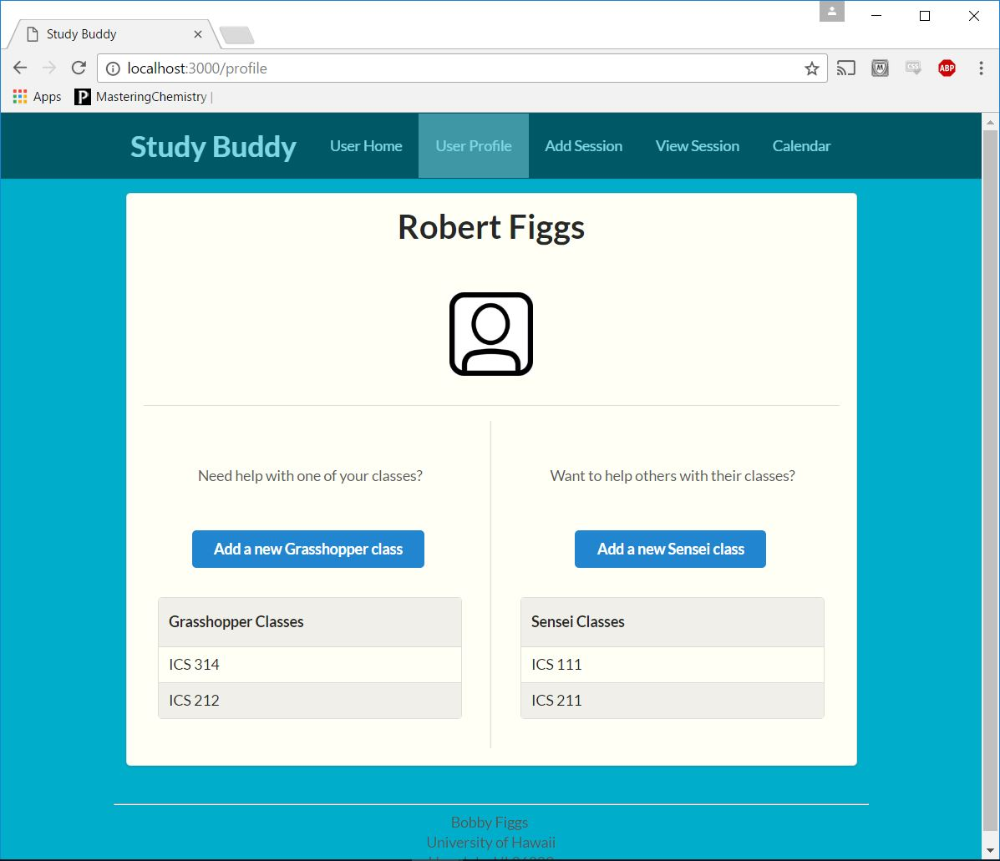
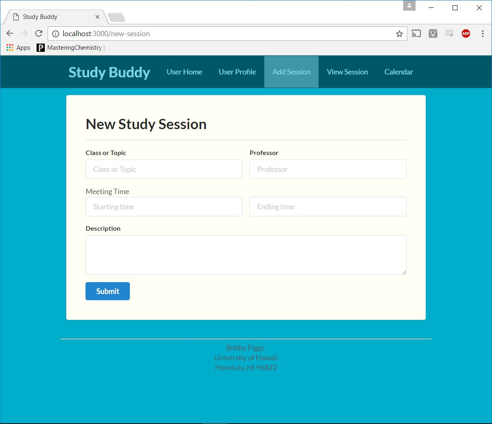
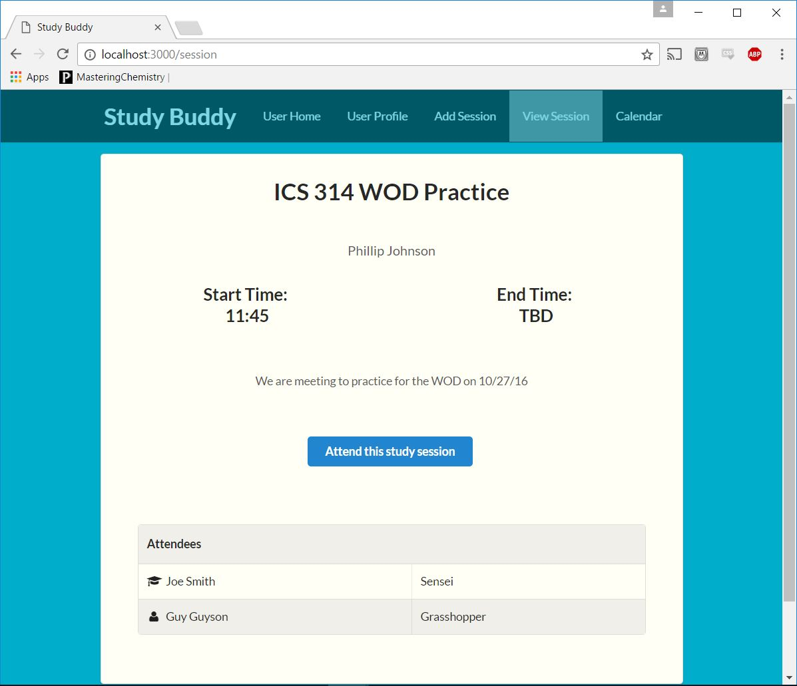
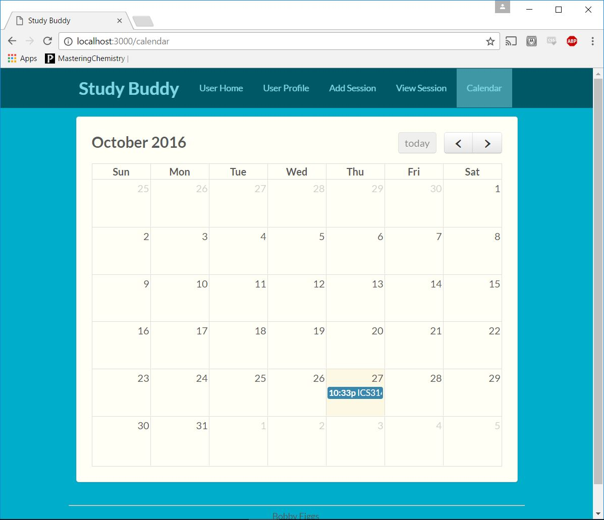

Study Buddy is an application for UHM ICS students to self-organize face-to-face study groups around a course, topic, or project.

Landing Page

Home Page

Profile Page

Add Session Page

View Session Page

View Calendar Page

